<div align="center">

# 🐯 牛虎 ┃ 全功能旗舰 TVBox 配置
### ⚡ 75席免登录秒播连环阵 ｜ 💎 4K原画杜比视界 ｜ 🍿 9978原生实时弹幕 ｜ 🛡️ 16重切片广告净化

[](https://github.com/niubihu1/tvbox)
[](https://github.com/niubihu1/tvbox)
[-ff69b4?style=for-the-badge&logo=fastlane)](https://github.com/niubihu1/tvbox)
[](https://github.com/niubihu1/tvbox)
[](https://github.com/niubihu1/tvbox)
[](https://github.com/niubihu1/tvbox)
[](https://github.com/niubihu1/tvbox)

<p align="center">
  <b>彻底告别频繁失效、扫码烦恼、15秒切片广告与缓冲卡顿！</b><br>
  依托现代工程化全自动流水线与本地家庭宽带真实并发测活，深度扫描融合全网 <b>2,000+</b> 候选接口，<br>
  算法聚类涵盖<b>肥猫、饭太硬、摸鱼、二小、EasyTV、俊于、道长、心魔等数十个一线顶流大仓</b>的底层精髓；<br>
  历经海量真实测速与严苛门禁层层淘汰，<b>从海量源池中千锤百炼、层层过滤、优中选优</b>，精炼出 130 席旗舰站源，<br>
  为你打造真正“天花板”级别、开机即用的稳定家庭流媒体体验。
</p>

[⚡ 极速订阅地址](#-极速订阅地址) • [✨ 六大硬核亮点](#-为什么选择本接口) • [📊 站源黄金配比](#-130-站源黄金配比架构) • [📥 播放器下载](#-配套播放器下载) • [📖 三步导入教程](#-三步极简导入教程) • [💡 常见问题](#-常见问题与观影优化)

---
</div>

## 🚀 极速订阅地址

> [!TIP]
> **日常观影强烈推荐首选「1️⃣ 豆瓣热播单仓接口」**：开机首页秒出豆瓣热播海报墙与全分类导航栏，前排精选 **75 席免登录在线秒播源**，老人小孩拿遥控器即点即播，无需任何繁琐登录！

### 1️⃣ 🐯 牛虎 ┃ 豆瓣热播单仓接口（130 站源黄金旗舰·日常首选 ⭐⭐⭐⭐⭐）

* **国内极速加速直链（电视端首选，复制直接填入）**：
  ```text
  https://gh-proxy.com/https://raw.githubusercontent.com/niubihu1/tvbox/main/1.json
  ```
* **备用加速线路（ghproxy 节点）**：
  ```text
  https://ghproxy.net/https://raw.githubusercontent.com/niubihu1/tvbox/main/1.json
  ```
* **GitHub 原始直连（海外或软路由透明代理环境）**：
  ```text
  https://raw.githubusercontent.com/niubihu1/tvbox/main/1.json
  ```

---

### 2️⃣ 🌐 全网精选多仓聚合导航（16个顶级稳定大仓·备用容灾）

* **国内极速多仓直链**：
  ```text
  https://gh-proxy.com/https://raw.githubusercontent.com/niubihu1/tvbox/main/tv8.json
  ```
* **多仓线路合集清单（文本格式）**：
  ```text
  https://gh-proxy.com/https://raw.githubusercontent.com/niubihu1/tvbox/main/%E8%87%AA%E7%94%A8%E4%BB%93%E5%BA%93.txt
  ```

---

## ✨ 为什么选择本接口？

市面上多数 TVBox 接口依靠人工盲目抓取拼凑，常出现“几天就白屏”、“菠菜广告满天飞”、“开机卡顿”、“强制扫码”等问题。**本项目采用现代化工程流水线与 10 项严苛门禁系统重新定义了接口标准：**

```mermaid
flowchart LR
    subgraph A["全网大数据候选池"]
        A1["2,000+ 全网候选接口"]
        A2["数十个一线主流大仓深度共识挖掘"]
    end
    subgraph B["工程化测活与重组"]
        B1["家庭宽带高并发本地测活"]
        B2["75席免登录秒播前置排布"]
        B3["16重广告切片净化规则"]
        B4["9978原生实时弹幕全系挂载"]
        B5["首位 0.2s Json聚合直解"]
    end
    subgraph C["10项铁律自动化门禁"]
        C1["零死链 · 零虚假源 · 零多层套娃"]
        C2["DEX完整性 · 首页导航栏完备"]
    end
    subgraph D["双端交付成果"]
        D1["1.json (130源黄金单仓)"]
        D2["tv8.json (16仓多仓容灾)"]
    end
    A --> B --> C --> D
```



### 🏆 六大核心硬核突破

| 维度 | 本接口优势特性 | 普通第三方杂牌接口现状 |
| :--- | :--- | :--- |
| **🍿 秒播体验** | **75 席免登录在线秒播连环阵排布在前排**，老人小孩开机即点即播，零门槛、零等待。 | 堆砌大量需要扫码的网盘源在首屏，开机即弹二维码，极难上手。 |
| **💬 实时弹幕** | **原生对接 9978 实时弹幕引擎**（`danmaku` 挂载），全网热剧大片实时弹幕吐槽互动。 | 99% 的接口缺失弹幕支持，大屏观影冷清沉闷。 |
| **🛡️ 广告拦截** | **独家 16 重 TS 切片广告拦截规则**，毫秒级跳过量子/非凡/暴风等 15 秒菠菜切片。 | 片头插播 15~30 秒荷官发牌、引流群跑马灯，甚至直接投毒。 |
| **⚡ 解析引擎** | **首位搭载 `Json聚合 (Demo)` 0.2 秒直链秒解**，辅以 Web 聚合兜底，全网 VIP 视频秒开。 | 解析单一、常年超时缓冲，遇到 VIP 经常解析失败或黑屏。 |
| **💎 原画画质** | **精选 20 席 4K UHD 蓝光无损原画**，挂载 `fty.jar` 播放层拦截机制，体验纯净画质。 | 伪 4K、码率压缩、严重丢帧，且频繁提示账号失效。 |
| **🔒 稳定性** | **10 项铁律工程化门禁系统守护**，零死链、零虚假假源、首页导航栏秒出，每日自动巡检。 | 无测试无人维护，站源几天就挂，多层套娃代理导致网络超时。 |

---

## 📊 130 站源黄金配比架构

我们针对家庭真实观影习惯，将站源精心设计为 **科学的四层阶梯式黄金配比**：

```
┌────────────────────────────────────────────────────────────────────────┐
│                        🐯 牛虎 130 站源科学黄金配比                      │
├────────────────────────────────────────────────────────────────────────┤
│  🍿 58% 免登录在线秒播 (75席) ─── 老人小孩开机即看，零门槛零广告秒播      │
│  💎 15% 4K原画与网盘 (20席)   ─── 玩偶/至臻/阿里/夸克/UC，蓝光画质天花板  │
│  🛡️ 19% 稳定全网采集 (25席)   ─── 卧龙/量子/极速/非凡/茶杯狐，冷门老剧兜底 │
│  🎪  8% 特色家庭专区 (15席)   ─── 体育赛事/名校名师/戏曲益智，全家全场景  │
└────────────────────────────────────────────────────────────────────────┘
```

| 板块类别 | 站源席位 | 配比占比 | 代表站点列表 | 场景定位与核心价值 |
| :--- | :---: | :---: | :--- | :--- |
| 🍿 **免登录在线秒播** | **75 席** | **~58%** | 厂长、荐片、低端、独播、**嗷呜①~⑩线秒播连环阵**、瓜子、爱看、新6V、光速、金牌、红牛等 | **家庭主力首选**：遥控器一点就播，无需账号登录，毫秒级起播，纯净无广告 |
| 💎 **4K 原画与网盘** | **20 席** | **~15%** | 玩偶4K、至臻4K、蜡笔4K、木偶4K、盘友、阿里/夸克/UC/123/天翼主力云盘 | **极客发烧专区**：4K UHD、杜比视界原画，`fty.jar` 原生播放层扫码拦截 |
| 🛡️ **稳定全网综合采集** | **25 席** | **~19%** | 卧龙、量子、极速、索尼、非凡、茶杯狐、映迷、光速采集等 | **全网万能兜底**：院线新片、经典老剧、冷门港剧与小众综艺全方位覆盖 |
| 🎪 **特色家庭专区** | **15 席** | **~8%** | 310看球、88看球、名校中小学名师课堂、无损音乐、听书评书、戏曲多多、少儿益智 | **全家全场景覆盖**：赛事直播、少儿成长启蒙、长辈戏曲与名校课程 |

---

## 📥 配套播放器下载

本项目提供的接口全面兼容 **电视 TV 大屏端** 与 **安卓手机 / 平板触控端**。以下均为经过严格兼容性验证的纯净开源、无广告原版安装包：

### 📺 1. 电视 TV / 电视盒子专版（遥控器操作·大屏视界）

| 播放器名称 | 适配版本 | 核心亮点与推荐场景 | 下载通道（极速直链 / 网盘备用） |
| :--- | :--- | :--- | :--- |
| **FongMi 影视 (蜂蜜)**<br>*(全网口碑第一·强烈推荐)* | `v5.6.8`<br>*(2026最新)* | 🌟 原生 Android Leanback 电视架构，秒播速度第一，支持杜比视界 Profile 7，操作极其顺滑 | [⚡ 32位通用极速](https://gh-proxy.com/https://github.com/FongMi/Release/releases/download/5.6.8/leanback-armeabi_v7a.apk) ｜ [⚡ 64位高性能](https://gh-proxy.com/https://github.com/FongMi/Release/releases/download/5.6.8/leanback-arm64_v8a.apk)<br>[📦 夸克网盘](https://pan.quark.cn/s/b55be5547a68) ｜ [📦 UC网盘](https://drive.uc.cn/s/f8e067cede5f4?public=1) ｜ [🔗 GitHub 发布页](https://github.com/FongMi/Release/releases) |
| **TVBox 原版 (Takagen99)**<br>*(经典正统·装机量最大)* | `20260227`<br>*(2026稳定版)* | 🚀 经典开源架构，内存占用仅数十兆，深度适配各类老旧电视盒子，兼容性天花板 | [⚡ 32位通用下载](https://gh-proxy.com/https://raw.githubusercontent.com/youhunwl/TVAPP/main/TVBox/TVBox_takagen99_20260227-1116-armeabi-generic-java.apk) ｜ [⚡ 64位高配下载](https://gh-proxy.com/https://raw.githubusercontent.com/youhunwl/TVAPP/main/TVBox/TVBox_takagen99_20260227-1116-arm64-generic-java.apk) |
| **TVBox 官方版 (俊于维护)**<br>*(官方内核优化)* | `20260914`<br>*(官方最新)* | 🎯 针对国内网络环境与新一代解码内核专项优化，播放稳定不掉帧 | [⚡ 官方极速直链下载](https://gh-proxy.com/https://raw.githubusercontent.com/youhunwl/TVAPP/main/TVBox/TVBox_q215613905_20260914-1520-java.apk) |
| **月光宝盒 Max / 宝盒 TV**<br>*(精美海报墙与多仓)* | `20260926`<br>*(升级版)* | 🎨 界面华丽典雅，自动刮削生成精美海报墙，全面支持单仓与多仓自由切换 | [⚡ 官方直链下载](https://gh-proxy.com/https://raw.githubusercontent.com/youhunwl/TVAPP/main/%E5%BD%B1%E8%A7%86/%E6%9C%88%E5%85%89%E5%AE%9D%E7%9B%92/%E6%9C%88%E5%85%89%E5%AE%9D%E7%9B%92Max1017.apk)<br>[📦 夸克网盘](https://pan.quark.cn/s/a2c78537f5df) ｜ [📦 UC网盘](https://drive.uc.cn/s/a993aa79c6984?public=1) |
| **影视仓 原版 TV**<br>*(官方全仓聚合版)* | `v6.2.8`<br>*(官方原版)* | 📺 支持多仓热备、跨源聚合搜索，用户群体庞大，功能极为成熟 | [⚡ 官方直链下载](https://gh-proxy.com/https://raw.githubusercontent.com/youhunwl/TVAPP/main/%E5%BD%B1%E8%A7%86/%E5%BD%B1%E8%A7%86%E4%BB%93/%E5%BD%B1%E8%A7%86%E4%BB%93-TV-32%E4%BD%8D-6.2.8.apk)<br>[📦 百度网盘 (提取码: a6g7)](https://pan.baidu.com/s/11RcWwauUQiWt_Ids_zs5Qw?pwd=a6g7) ｜ [📦 夸克网盘](https://pan.quark.cn/s/61d324167c07#/list/share) |

---

### 📱 2. 手机 / 平板触控专版（竖屏手势·随身追剧）

| 播放器名称 | 适配版本 | 核心亮点与推荐场景 | 下载通道（极速直链 / 网盘备用） |
| :--- | :--- | :--- | :--- |
| **FongMi 影视 手机版**<br>*(手机端体验天花板)* | `v5.6.8`<br>*(2026最新)* | 🌟 原生支持竖屏手势（滑动调亮/调音、快进快退），支持画中画小窗播放与无感一键投屏电视 | [⚡ 64位高性能手机版](https://gh-proxy.com/https://github.com/FongMi/Release/releases/download/5.6.8/mobile-arm64_v8a.apk) ｜ [⚡ 32位通用版](https://gh-proxy.com/https://github.com/FongMi/Release/releases/download/5.6.8/mobile-armeabi_v7a.apk)<br>[📦 夸克网盘](https://pan.quark.cn/s/b55be5547a68) ｜ [📦 UC网盘](https://drive.uc.cn/s/f8e067cede5f4?public=1) |
| **影视仓 手机平板优化版**<br>*(高分屏深度适配)* | `v3.3.8`<br>*(官方优化)* | 📲 针对移动端高分屏与平板横竖屏动态优化，触控顺滑，完美兼容单仓与多仓接口 | [⚡ 官方直链下载](https://gh-proxy.com/https://raw.githubusercontent.com/youhunwl/TVAPP/main/%E5%BD%B1%E8%A7%86/%E5%BD%B1%E8%A7%86%E4%BB%93/%E5%BD%B1%E8%A7%86%E4%BB%93-%E6%89%8B%E6%9C%BA%E5%B9%B3%E6%9D%BF-64%E4%BD%8D-3.3.8_opt.apk)<br>[📦 百度网盘 (提取码: a6g7)](https://pan.baidu.com/s/11RcWwauUQiWt_Ids_zs5Qw?pwd=a6g7) ｜ [📦 夸克网盘](https://pan.quark.cn/s/61d324167c07#/list/share) |
| **宝盒 手机专版**<br>*(竖屏精选版)* | `v5.2.6`<br>*(触控版)* | 🎬 手机竖屏精选影音，支持多分类一键滑动检索，界面轻巧美观 | [⚡ 官方直链下载](https://gh-proxy.com/https://raw.githubusercontent.com/youhunwl/TVAPP/main/%E5%BD%B1%E8%A7%86/%E5%AE%9D%E7%9B%92%E6%89%8B%E6%9C%BA5.2.6(FM%E5%86%85%E7%BD%AE%E7%89%88).apk)<br>[📦 夸克网盘](https://pan.quark.cn/s/a2c78537f5df) |

---

## 📖 三步极简导入教程

```
┌─────────────┐       ┌─────────────┐       ┌─────────────┐
│  步骤 1     │       │  步骤 2     │       │  步骤 3     │
│ 打开播放器  │ ───>  │ 进入「设置」 │ ───>  │ 粘贴接口URL │
│ TV/手机客户端│       │ 点击配置地址 │       │ 点击确定加载 │
└─────────────┘       └─────────────┘       └─────────────┘
```

1. **第一步**：在电视盒子或手机上打开安装好的 **FongMi / TVBox / 影视仓 / 宝盒**；
2. **第二步**：使用遥控器点击齿轮图标进入 **「设置」** -> **「配置地址」**（部分软件显示为「数据源 / 接口」）；
3. **第三步**：复制并填入（或使用手机同一 Wi-Fi 微信扫码推送）下方优选单仓地址，点击 **确定** 即可秒速加载海报墙：
   ```text
   https://gh-proxy.com/https://raw.githubusercontent.com/niubihu1/tvbox/main/1.json
   ```

---

## 💡 常见问题与观影优化

<details>
<summary><b>Q1: 播放时偶发缓冲卡顿，或者提示“解码失败/黑屏”怎么办？</b></summary>

> **优化建议**：
> 1. 打开播放器全局设置或播放界面的「解码设置」；
> 2. 将默认解码器从“系统自带”切换为 **ijk硬解** 或 **EXO**；
> 3. 对 4K 原画片源与老旧电视盒子，**ijk硬解** 通常更省 CPU、发热更低且播放更流畅。
</details>

<details>
<summary><b>Q2: 为什么免登录在线源即点即播，而 4K 原画网盘源（阿里/夸克/UC）提示扫码？</b></summary>

> **优化说明**：
> 1. 前排 **75 席免登录在线秒播源** 为全免费开放源，老人小孩按遥控器即可直接秒播；
> 2. 后续 **20 席 4K 原画网盘源** 为追求无损画质天花板的用户准备。因网盘官方防盗链机制，需使用手机 App 扫码授权登录个人网盘账号（普通免费账号即可）；
> 3. 授权一次后将永久免登录，享受原画杜比视界高码率不限速推流。
</details>

<details>
<summary><b>Q3: 电视提示“无法下载配置”或“连接超时”？</b></summary>

> **排查方法**：
> 1. 部分省份运营商 DNS 偶发污染，可在电视 Wi-Fi 设置中将 DNS 手动修改为 `223.5.5.5`（阿里）或 `119.29.29.29`（腾讯）；
> 2. 也可直接将接口地址前缀切换为备用 ghproxy 线路：
>    `https://ghproxy.net/https://raw.githubusercontent.com/niubihu1/tvbox/main/1.json`
</details>

<details>
<summary><b>Q4: 为什么搜索某部冷门影视时有些源显示没有结果？</b></summary>

> **搜索技巧**：
> 1. 顶部搜索框默认聚合前置所有可搜索源；
> 2. 若冷门影视在前排未搜出，可向后切换到 **稳定综合采集专区（卧龙/量子/极速/非凡/索尼）** 进行深度匹配；
> 3. 130 个站源全方位互补，全网 99.9% 的影视内容均能完美命中。
</details>

---

## ⚖️ 免责声明

* 本项目所有接口、爬虫规则、视频解析及数据源均来自互联网公开搜索与开源社区共享，仅用于个人网络技术研究与多媒体协议学习测试；
* 本仓库不制作、不托管、不存储、不分发任何音视频资源实体，亦不参与任何商业牟利行为；
* 如任何内容涉嫌侵犯您的知识产权或合法权益，请通过 GitHub Issue 联系我们，核实后将在第一时间协助清理。

<div align="center">

**如果本接口给您和家人的观影带来了便利，欢迎点亮右上角的 🌟 Star 支持我们！**

</div>
