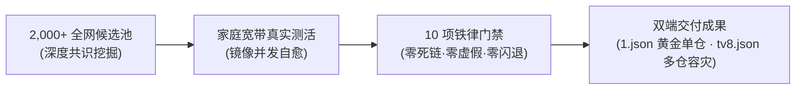

<div align="center">

# 🐯 牛虎 ┃ 全功能旗舰 TVBox 订阅
### ⚡ 豆瓣开屏 · 扫码直达 ｜ 🍿 75席免登秒播 ｜ 💎 4K原画 ｜ 💬 实时弹幕 ｜ 🛡️ 16重广告切片净化

[](https://github.com/niubihu1/tvbox)
[](https://github.com/niubihu1/tvbox)
[-ff69b4?style=for-the-badge&logo=fastlane)](https://github.com/niubihu1/tvbox)
[](https://github.com/niubihu1/tvbox)
[](https://github.com/niubihu1/tvbox)

<p align="center">
  <b>彻底告别失效白屏、强制扫码、切片广告与缓冲卡顿！</b><br>
  依托工程化自动化流水线与家庭宽带真实高并发测活，深度扫描融合全网 <b>2,000+</b> 候选接口。<br>
  历经大数据共识聚类与 <b>10 项严苛门禁系统</b> 层层筛除，精炼打造开箱即用的天花板级家庭观影体验。
</p>

[⚡ 极速订阅地址](#-极速订阅地址) • [✨ 六大核心优势](#-六大核心优势) • [📊 站源黄金配比](#-站源黄金配比架构) • [📥 播放器下载](#-配套播放器下载) • [📖 三步极简导入](#-三步极简导入教程) • [💡 常见问题](#-常见问题与观影优化)

---
</div>

## 🚀 极速订阅地址

> [!TIP]
> **日常观影强烈推荐首选「1️⃣ 豆瓣热播单仓接口」**：
> 开机即出豆瓣热播海报墙与分类导航；第 2 位特设扫码配置中心；紧随 **75 席免登录秒播连环阵**，即点即播！

### 1️⃣ 🐯 牛虎 ┃ 豆瓣热播单仓接口（134 站源黄金旗舰·日常首选 ⭐⭐⭐⭐⭐）

* **国内极速加速直链（电视端首选，复制直接填入）**：
  ```text
  https://gh-proxy.com/https://raw.githubusercontent.com/niubihu1/tvbox/main/1.json
  ```
* **备用加速线路（ghproxy 节点）**：
  ```text
  https://ghproxy.net/https://raw.githubusercontent.com/niubihu1/tvbox/main/1.json
  ```
* **GitHub 原始直连（海外或软路由透明代理）**：
  ```text
  https://raw.githubusercontent.com/niubihu1/tvbox/main/1.json
  ```

---

### 2️⃣ 🌐 全网精选多仓聚合导航（16个顶级稳定大仓·备用容灾）

* **国内极速多仓直链**：
  ```text
  https://gh-proxy.com/https://raw.githubusercontent.com/niubihu1/tvbox/main/tv8.json
  ```
* **多仓线路合集清单（文本格式）**：
  ```text
  https://gh-proxy.com/https://raw.githubusercontent.com/niubihu1/tvbox/main/%E8%87%AA%E7%94%A8%E4%BB%93%E5%BA%93.txt
  ```

---

## ✨ 六大核心优势

市面上多数接口依赖人工盲目抓取拼凑，常出现几天失效、广告满天飞、强制扫码等问题。本项目采用自动化流水线与门禁系统重新定义标准：



| 维度 | 本接口优势特性 | 普通第三方接口现状 |
| :--- | :--- | :--- |
| 🥇 **排位体系** | **#0 豆瓣海报墙，#1 配置中心扫码，#2~75 免登秒播连环阵**，层级分明科学。 | 首屏胡乱堆砌网盘源，开机即弹二维码，极难上手。 |
| 🍿 **秒播体验** | **75 席免登录在线秒播源前置**，老人小孩开机即点即播，零门槛、零等待。 | 大量源需复杂登录或账号绑定，操作门槛高。 |
| 💬 **实时弹幕** | **原生集成 9978 实时弹幕引擎**（全系挂载 `danmaku`），大屏互动追剧不冷清。 | 99% 的接口缺失弹幕支持，观影氛围单一。 |
| 🛡️ **广告拦截** | **16 重 TS 切片广告净化规则**，毫秒级跳过量子/非凡/暴风等菠菜与引流广告。 | 片头插播 15~30 秒菠菜切片或跑马灯，甚至恶意投毒。 |
| 💎 **原画画质** | **精选 20 席 4K UHD 蓝光原画**，纯 Java DEX 双轨驱动，彻底杜绝 so 库闪退。 | 伪 4K、严重压缩丢帧，且频繁提示账号或外挂 Jar 失效。 |
| 🔒 **工程门禁** | **10 项铁律工程化门禁守护**，自动化排查死链与 DEX 类名匹配，每日自愈更新。 | 无人维护测试，站源几天即失效，套娃代理频繁超时。 |

---

## 📊 站源黄金配比架构

针对家庭真实观影习惯，全量站源设计为科学的四层阶梯排布：

```
┌────────────────────────────────────────────────────────────────────────┐
│                        🐯 牛虎 134 站源科学黄金配比                      │
├────────────────────────────────────────────────────────────────────────┤
│  🍿 56% 免登录在线秒播 (75席) ─── 老人小孩开机即看，零门槛零广告秒播      │
│  💎 15% 4K原画与网盘 (20席)   ─── 玩偶/至臻/阿里/夸克/UC，蓝光画质天花板  │
│  🛡️ 19% 稳定全网采集 (25席)   ─── 卧龙/量子/极速/非凡/茶杯狐，冷门老剧兜底 │
│  🎪  8% 特色家庭专区 (14席)   ─── 体育看球/名师课堂/戏曲益智，全家全场景  │
└────────────────────────────────────────────────────────────────────────┘
```

* **Site #0 (首位)**：`🐯牛虎 ┃ 豆瓣热播` —— 官方海报墙与热门影视分类导航，开机即显；
* **Site #1 (第二位)**：`🐯牛虎 ┃ 配置中心` —— 电视大屏弹出阿里/夸克/UC扫码登录，一处绑定全盘通用；
* **Site #2 ~ 76**：`🏭厂长影视` + `嗷呜①~⑪线秒播连环阵` + 优质在线秒播大厂，即点即播；
* **Site #77+**：4K 原画专区（玩偶、木偶、至臻、蜡笔等并发测速自愈）+ 稳定采集 + 特色家庭专区。

---

## 📥 配套播放器下载

接口全面兼容 **电视 TV 大屏端** 与 **手机 / 平板触控端**，以下均为官方纯净开源安装包：

### 📺 1. 电视 TV / 电视盒子专版（遥控器操作）

| 播放器名称 | 版本 | 特色亮点 | 下载通道 |
| :--- | :---: | :--- | :--- |
| **FongMi 影视 (蜂蜜)**<br>*(全网口碑第一·强烈推荐)* | `v5.6.8` | 原生 Android TV 架构，秒播第一，支持杜比视界，极度流畅 | [⚡ 32位通用极速](https://gh-proxy.com/https://github.com/FongMi/Release/releases/download/5.6.8/leanback-armeabi_v7a.apk) ｜ [⚡ 64位高性能](https://gh-proxy.com/https://github.com/FongMi/Release/releases/download/5.6.8/leanback-arm64_v8a.apk)<br>[📦 夸克网盘](https://pan.quark.cn/s/b55be5547a68) ｜ [📦 UC网盘](https://drive.uc.cn/s/f8e067cede5f4?public=1) |
| **TVBox 原版 (Takagen99)**<br>*(经典开源·装机量最大)* | `20260227` | 内存占用仅数十兆，深度适配各类老旧电视盒子，兼容性天花板 | [⚡ 32位通用下载](https://gh-proxy.com/https://raw.githubusercontent.com/youhunwl/TVAPP/main/TVBox/TVBox_takagen99_20260227-1116-armeabi-generic-java.apk) ｜ [⚡ 64位高配下载](https://gh-proxy.com/https://raw.githubusercontent.com/youhunwl/TVAPP/main/TVBox/TVBox_takagen99_20260227-1116-arm64-generic-java.apk) |
| **月光宝盒 Max**<br>*(精美海报墙)* | `20260926` | 界面优雅华丽，自动刮削精美海报墙，单仓与多仓自由切换 | [⚡ 官方直链下载](https://gh-proxy.com/https://raw.githubusercontent.com/youhunwl/TVAPP/main/%E5%BD%B1%E8%A7%86/%E6%9C%88%E5%85%89%E5%AE%9D%E7%9B%92/%E6%9C%88%E5%85%89%E5%AE%9D%E7%9B%92Max1017.apk)<br>[📦 夸克网盘](https://pan.quark.cn/s/a2c78537f5df) ｜ [📦 UC网盘](https://drive.uc.cn/s/a993aa79c6984?public=1) |
| **影视仓 原版 TV**<br>*(官方全仓聚合版)* | `v6.2.8` | 支持多仓热备、跨源聚合搜索，功能全面成熟 | [⚡ 官方直链下载](https://gh-proxy.com/https://raw.githubusercontent.com/youhunwl/TVAPP/main/%E5%BD%B1%E8%A7%86/%E5%BD%B1%E8%A7%86%E4%BB%93/%E5%BD%B1%E8%A7%86%E4%BB%93-TV-32%E4%BD%8D-6.2.8.apk)<br>[📦 百度网盘 (pwd: a6g7)](https://pan.baidu.com/s/11RcWwauUQiWt_Ids_zs5Qw?pwd=a6g7) ｜ [📦 夸克网盘](https://pan.quark.cn/s/61d324167c07#/list/share) |

### 📱 2. 手机 / 平板触控专版（竖屏手势）

| 播放器名称 | 版本 | 特色亮点 | 下载通道 |
| :--- | :---: | :--- | :--- |
| **FongMi 影视 手机版**<br>*(移动端体验天花板)* | `v5.6.8` | 原生滑动调光/调音/快进快退，支持画中画与无感一键投屏 | [⚡ 64位高性能](https://gh-proxy.com/https://github.com/FongMi/Release/releases/download/5.6.8/mobile-arm64_v8a.apk) ｜ [⚡ 32位通用](https://gh-proxy.com/https://github.com/FongMi/Release/releases/download/5.6.8/mobile-armeabi_v7a.apk)<br>[📦 夸克网盘](https://pan.quark.cn/s/b55be5547a68) ｜ [📦 UC网盘](https://drive.uc.cn/s/f8e067cede5f4?public=1) |
| **影视仓 手机平板优化版** | `v3.3.8` | 高分屏与平板横竖屏动态自适应，触控跟手流畅 | [⚡ 官方直链下载](https://gh-proxy.com/https://raw.githubusercontent.com/youhunwl/TVAPP/main/%E5%BD%B1%E8%A7%86/%E5%BD%B1%E8%A7%86%E4%BB%93/%E5%BD%B1%E8%A7%86%E4%BB%93-%E6%89%8B%E6%9C%BA%E5%B9%B3%E6%9D%BF-64%E4%BD%8D-3.3.8_opt.apk)<br>[📦 百度网盘 (pwd: a6g7)](https://pan.baidu.com/s/11RcWwauUQiWt_Ids_zs5Qw?pwd=a6g7) |

---

## 📖 三步极简导入教程

```
┌─────────────┐       ┌─────────────┐       ┌─────────────┐
│   步骤 1    │       │   步骤 2    │       │   步骤 3    │
│ 打开播放器  │ ───>  │ 进入「设置」 │ ───>  │ 粘贴接口URL │
│ TV/手机客户端│       │ 点击配置地址 │       │ 点击确定加载 │
└─────────────┘       └─────────────┘       └─────────────┘
```

1. **打开播放器**：在电视盒子或手机打开 **FongMi / TVBox / 影视仓**；
2. **进入配置**：使用遥控器点击 **「设置」** ➔ **「配置地址」**（或「数据源 / 接口」）；
3. **填入接口**：粘贴（或手机微信扫码推送）下方地址，点击 **确定** 即可秒出海报墙：
   ```text
   https://gh-proxy.com/https://raw.githubusercontent.com/niubihu1/tvbox/main/1.json
   ```

---

## 💡 常见问题与观影优化

<details>
<summary><b>Q1: 偶发缓冲卡顿，或提示“解码失败/黑屏”怎么办？</b></summary>

> **优化建议**：
> 1. 打开播放器的「设置」➔「解码设置」；
> 2. 将默认解码器从“系统自带”切换为 **ijk硬解** 或 **EXO**；
> 3. 对 4K 高码率片源或老旧电视盒子，**ijk硬解** 占用 CPU 更低、发热少且不掉帧。
</details>

<details>
<summary><b>Q2: 如何使用 4K 原画网盘源（阿里/夸克/UC）？</b></summary>

> **操作指引**：
> 1. 首页第 1 位已特设 **「🐯牛虎 ┃ 配置中心」**；
> 2. 点击进入即可弹出大尺寸二维码，使用手机阿里/夸克/UC 客户端扫码授权一次；
> 3. 授权后全网盘源通用，永久免登畅享 4K 杜比视界高码率原画推流。
</details>

<details>
<summary><b>Q3: 电视提示“无法下载配置”或“连接超时”？</b></summary>

> **排查方法**：
> 1. 部分省份运营商 DNS 偶发拦截，可在电视 Wi-Fi 设置中将 DNS 修改为 `223.5.5.5`（阿里）或 `119.29.29.29`（腾讯）；
> 2. 也可直接将接口地址前缀切换为备用线路：
>    `https://ghproxy.net/https://raw.githubusercontent.com/niubihu1/tvbox/main/1.json`
</details>

<details>
<summary><b>Q4: 搜索冷门剧集时如何提高命中率？</b></summary>

> **搜索技巧**：
> 1. 顶部全局搜索默认优先聚合秒播源；
> 2. 若冷门资源在前排未搜出，可向后切换到 **稳定综合采集专区（卧龙/量子/极速/非凡/索尼）** 深度匹配；
> 3. 134 席站源全方位互补，全网热门冷门资源全面覆盖。
</details>

---

## ⚖️ 免责声明

* 本项目所有接口、爬虫规则、视频解析及数据源均来自互联网公开资源与开源社区，仅供个人网络技术研究与多媒体协议学习交流使用；
* 本仓库不制作、不托管、不存储任何音视频实体，亦不参与任何商业牟利行为；
* 如任何内容涉嫌侵犯知识产权，请通过 GitHub Issue 联系我们，核实后将在第一时间协助清理。

<div align="center">

**如果本接口给您和家人的观影带来了便利，欢迎点亮右上角的 🌟 Star 支持我们！**

</div>
