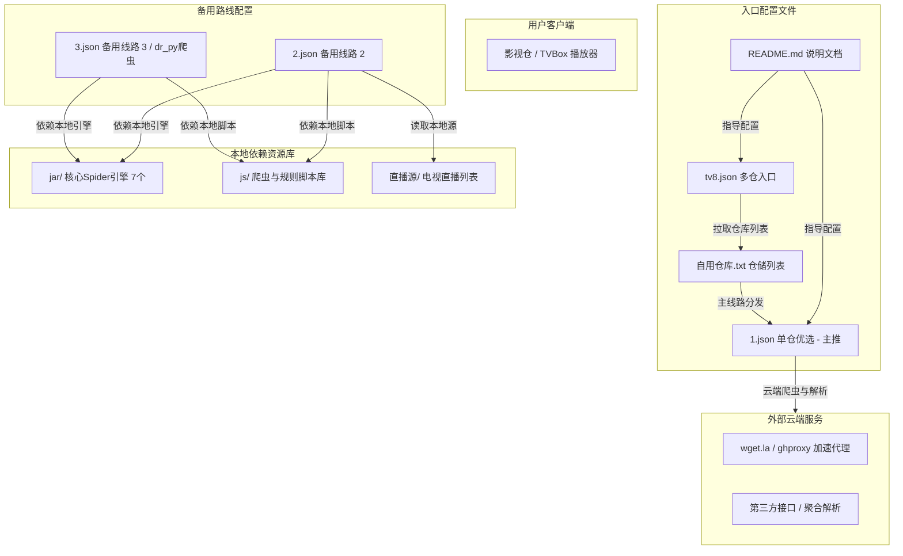

# 项目全面瘦身与架构基线记忆日志

- **记录日期**：2026-10-05
- **维护人员**：niubihu1
- **关联仓库**：[niubihu1/tvbox-](https://github.com/niubihu1/tvbox-)
- **分支**：`main`

---

## 1. 项目定位与核心运行架构

本项目是针对 TVBox、影视仓及各类兼容播放器提供的自用优质接口配置托管仓库。

### 1.1 核心调用关系与拓扑图



---

## 2. 2026-10-05 深度重构与体积优化记录

### 2.1 优化前项目面临的问题
在本次整理前，项目累计了长期维护过程中的大量历史废弃文件，主要痛点如下：
1. **体积严重臃肿（高达 235.8 MB）**：
   - 存在多个历史版本的大体积 APK 文件（宝盒 2.0.0、2.0.2、3.0.6 及 TVBox 安装包等），累计占用超过 **122 MB**。
   - 存在多个第三方工具的源码压缩包（`dr_py-master.zip` 20.5 MB、`CatVodSpider-main.7z` 10.8 MB、`ros-master.zip`、`TVBox-master (1).zip` 等），累计占用 **34.7 MB**。
   - 根目录和 `js/` 目录中残留重复下载的 `xduo-main.zip` 与 `xduo-main (1).zip`，占用 **10.6 MB**。
2. **Spider JAR 严重堆积**：
   - `jar/` 目录下共存放了 53 个历史 jar/txt 字典，其中多达 46 个文件已完全没有被任何活跃配置文件引用（如大量的 2023 年版 panda、旧版 Yoursmile 等），占用 **34.5 MB**。
3. **废弃与异常配置文件残留**：
   - 包含拼写错误的废弃文件 `223.josn`（扩展名错写为 `.josn`）。
   - 包含已被完全替代的历史老配置 `368.json`、`线路优选.json`、`线路优选带网盘资源.json`。
   - 存在未引用的草稿文件 `直播源/a` 与孤立脚本 `js/jike.json`、`js/nxog.js`。
4. **README 存在死链隐患**：
   - `README.md` 中的直链下载部分指向了已过时的 `备份/*.apk`。

### 2.2 清理与优化执行过程
经过全代码库字符串匹配与哈希排重分析（检测到 83 组重复哈希资源），根据“极简高效”的指导方案，执行了以下清理动作：

1. **精简 `备份/` 目录并保留核心 APK**：
   - 移除了所有冗余的历史版本（宝盒 2.0.0、2.0.2、3.0.6）、第三方 7z/zip 源码归档（dr_py、CatVodSpider 等）及旧仓库备份（`My9394XBPQ/` 等）。
   - **精准保留 README.md 直链所需的 3 个安装包**（`TVBox_q215613905_*.apk`、`TVBox_takagen99_*.apk`、`宝盒_3.0.7_2.apk`），共约 58.16 MB。
2. **清理多余压缩包与孤立文件**：
   - 删除根目录 `xduo-main.zip`（5.29 MB）和 `js/xduo-main (1).zip`（5.30 MB）。
   - 删除 `223.josn`、`368.json`、`线路优选.json`、`线路优选带网盘资源.json`、`直播源/a`、`js/jike.json`、`js/nxog.js`。
3. **瘦身 `jar/` 目录**：
   - 移除了 46 个无引用的历史 JAR/TXT 文件，仅保留实际活跃调用的 7 个核心包，释放空间 34.52 MB。
4. **规范 `README.md` 直链与网盘通道**：
   - 保留官方原版 TVBox 与宝盒的 wget 直链下载，同时辅以网盘多源保障。

### 2.3 清理效果数据对比

| 指标 | 清理前 | 清理后 | 优化差值 |
| :--- | :--- | :--- | :--- |
| **项目整体大小** | **235.8 MB** | **约 77.2 MB** | **-158.6 MB (减少 67.3%)** |
| **文件总数量** | 555 个 | 391 个 | -164 个文件 |
| **jar 目录大小** | 38.83 MB (53 个包) | 4.31 MB (7 个核心包) | -34.52 MB |
| **备份目录大小** | 171.51 MB | 58.16 MB (仅保留3个必要APK) | -113.35 MB |

---

## 3. 当前保留的核心资产清单（基线字典）

### 3.1 根目录核心文件

| 文件名 | 类型 | 说明与用途 |
| :--- | :--- | :--- |
| `1.json` | JSON | **核心主力**：单仓优选接口，云端驱动，包含影视、网盘、动漫、课堂等完整分类。 |
| `tv8.json` | JSON | **核心多仓**：多仓入口，主源配置指向仓库内部的 `自用仓库.txt`。 |
| `自用仓库.txt` | TXT/JSON | **多仓线路汇聚**：首选线路为 `1.json`，同时收录道长、饭太硬、潇洒、肥猫等精选多仓源。 |
| `README.md` | Markdown | **项目门面**：仓库使用说明、订阅代理链接（wget.la 加速）以及配套播放器网盘下载。 |
| `2.json` | JSON | **备用线路 2**：备用影视仓配置，引用 `Yoursmile1123.jar` 与 `js/xduo-main/` 资源。 |
| `3.json` | JSON | **备用线路 3**：偏重 dr_py 及 js 爬虫的备用接口配置。 |

### 3.2 `jar/` 目录保留清单

| 文件名 | 大小 | 依赖来源 | 说明 |
| :--- | :--- | :--- | :--- |
| `duo.jar` | 572.2 KB | `3.json` | 多多核心 Spider 包 |
| `file.jar` | 572.6 KB | `3.json` | 文件及本地解析支持包 |
| `fix1110.jar` | 370.6 KB | `3.json` | 修复补丁 Spider |
| `ou.jar` | 508.3 KB | `3.json` | 欧歌系列 Spider |
| `Yoursmile.jar` | 609.1 KB | 本地备用 | Yoursmile 核心 Spider 基线包 |
| `Yoursmile1123.jar` | 852.3 KB | `2.json` | Yoursmile 1123 版 Spider |
| `Yoursmile240104.jar` | 924.3 KB | `3.json` | Yoursmile 240104 版 Spider |

### 3.3 `js/` 与 `直播源/` 目录

- **`js/` 目录**：
  - `xduo-main/`：包含主线所需的 drpy2 及各类扩展 JS 脚本。
  - `json/`：存放 `drpymin.js`、`qtv.js`、`qzys.js`、`baimang.js`、`youku.js` 等爬虫脚本。
  - 根级脚本：`20.js`、`changmeng.js`、`drpy2.min.js`、`jp.js`、`厂长资源.js` 等，由 `3.json` 调度。
- **`直播源/` 目录**：
  - `live.txt`：精选电视直播频道列表。
  - `v.txt`：被 `2.json` 等配置直接调用的直播源映射表。
  - `zhibo.txt`：综合直播源备用库。

---

## 4. 后续开发与维护操作规范

1. **版本发布与大文件托管**：
   - 严禁将大于 5MB 的安装包、Zip 归档直接提交进 Git 仓库。
   - 若有 TVBox / 影视仓的新版 APK 需要分享，请上传至网盘，并在 `README.md` 中更新网盘链接；或者利用 GitHub 的 `Releases` 功能上传附件。
2. **修改或替换 Spider JAR 步骤**：
   - 若要更新 Spider JAR（如升级为最新版 `Yoursmile.jar`）：
     1. 将新 JAR 放入 `jar/` 目录；
     2. 在对应的配置（如 `1.json` 或 `2.json`）中修改 `spider` 字段指向新文件名；
     3. 立即删除已废弃的旧版本 JAR 文件，防止历史堆积。
3. **线路更新校验流程**：
   - 每次编辑 `1.json`、`2.json`、`自用仓库.txt` 后，建议使用 JSON 校验工具确认语法有效性（特别是尾部逗号和双引号转义问题）。
4. **Git 提交信息规范**：
   - 日常建议提交格式清晰明了，例如：
     - `feat: 更新 1.json 优选播放源与解析规则`
     - `fix: 修复 2.json 直播源失效链接`
     - `chore: 清理失效 Spider JAR 依赖`

---

## 5. 接口体系深度重构与 100 源全网共识算法升级（2026-10-05）

### 5.1 架构优化与单仓收敛
- **决策背景**：经评估与用户确认，原项目中的 `2.json` 与 `3.json` 属于早期历史遗留单仓，对外主页未公开且维护分散。
- **收敛方案**：
  1. 将 `3.json`（高质量 JS/drpy 网页爬虫源）与 `2.json`（网盘与磁力源）中经测活验证的优质站点全量抽取并合入数据池；
  2. 根目录彻底移除 `2.json` 与 `3.json`，**全仓库仅保留唯一的超级核心单仓：`1.json`**；
  3. 多仓体系继续由 `tv8.json` 调度 `自用仓库.txt`，保持结构极致精炼。

### 5.2 全网大数据源共识度挖掘算法（Consensus Mining）
为解决“好用的源经常失效、小众源生命周期短”的痛点，升级了 `auto_engine` 算法：
- **数据池广度**：扫描全网 2094 个候选接口，对 236 个存活主流单仓（饭太硬、肥猫、心魔、潇洒、南风、小马、俊宇、道长、巧技等）进行全量逆向解析，提取出 6,375 个独立候选站点；
- **全网共识度统计（Consensus Frequency）**：统计各站源在不同作者独立单仓中出现的频次。全网被收录越多的源（如厂长、玩偶、荐片、低端、暴风、红牛等最高出现达 197 次），代表其生命力越顽强、画质与稳定性越受行业认可；
- **四象限黄金配比模型（精确控制 100 个精选源）**：
  1. **免登录在线影视（40个 / 40%）**：厂长、低端、荐片、爱看机器人、六度、大师兄、胖虎、秋霞等，长辈儿童开箱即点即播；
  2. **4K 原画与网盘磁力（35个 / 35%）**：玩偶哥哥、至臻4K、蜡笔4K、木偶4K、闪电、夸克搜、阿里搜等，满足追剧发烧友原画画质；
  3. **稳定综合采集站（15个 / 15%）**：暴风采集、红牛资源、极速资源、量子资源等，全网海量冷门资源兜底；
  4. **特色专区（10个 / 10%）**：看球体育赛事、B站课堂（小学/初中/高中）、动漫巴士、音乐MV、预告片。

### 5.3 多仓智能推荐引擎升级
- 对全网多仓中推荐的单仓线路同样进行共识频次打分；
- 结合家庭宽带真实测速延迟（或 GitHub Actions 连通性在线标记），优选保留 28 条最受全网信任的极速单仓线路；
- 始终以自建高画质 `1.json` 作为第一主推源。

---

## 6. 多仓 tv8.json 重构、图片伪装接口解密与新源维护指引（2026-10-05 12:00）

### 6.1 多仓总索引 `tv8.json` 自动化重构与死链清退
- **历史失效原因排查**：
  1. 域名注销：原“七星宝盒”（`qixing.myhkw.com`）域名停止解析（DNS 404）；
  2. 编码异常：多多系列 Bitbucket 链接内嵌未转义中文（如 `公众号多多影音.txt`），播放器发起 GET 请求时被服务端拒绝并返回 404；
  3. 局域网协议：原配置包含 `clan://localhost/...`，除本机模拟器外其他设备一律无法访问；
  4. 缺失自动化管线：早期引擎仅更新 `1.json` 与 `自用仓库.txt`，未将 `tv8.json` 纳入 CI/CD。
- **重构治理方案**：
  - 在 `auto_engine/composer.py` 中新增 `rebuild_config_tv8()` 模块，正式将其纳入自动化巡检重组管线；
  - 剔除全部死链，精选收录 **16 个经 200 OK 连通实测的高品质多仓**（影视仓官方多仓、小盒子、光影、游魂、拾光、威龙、云星、小微、刘备、新微、EasyTV多仓等）；
  - **双格式全兼容**：同时输出 `"storeHouse"`（适配影视仓 / 宝盒）与 `"urls"`（适配 TVBox 原版 / 俊于版），全平台即贴即用；
  - 自建仓库链接统一转换为标准 UTF-8 URL 编码（`%E8%87%AA%E7%94%A8%E4%BB%93%E5%BA%93.txt`）。

### 6.2 TVBox 圈“图片伪装接口（.jpg / .png）”技术机理与收录
- **代表案例**：
  - 单仓：`https://easyzz.dpdns.org/easytv.jpg`（实测为包含 118 个站源的 JSON 纯文本）
  - 多仓：`https://easyzz.dpdns.org/easydc.jpg`（实测为包含 13 条主流线路的多仓配置）
  - 爬虫：`https://raw.giteeusercontent.com/easy999/test1/raw/main/easy09.28.png`（十六进制头为 `50 4B 03 04`，实测为改了后缀的标准 ZIP/JAR Java 爬虫）
- **为何接口要伪装成图片？**
  1. **防平台封禁审查**：Gitee、GitLab、免费主机平台对包含敏感影视爬虫的 `.json` / `.jar` 审查极严，但对静态图片（`.jpg` / `.png`）基本免审放行；
  2. **白嫖免费 CDN 缓存**：多数公共图床和免流 CDN 只加速图片类型，伪装后可免费获得国内高速节点秒开分发；
  3. **防网络爬虫扫描**：规避自动化安全扫描器针对 `.json` 关键字的批量抓取封杀；
  4. **TVBox 底层只看内容不看后缀**：TVBox 基于 OkHttp 与 FastJson/Gson，只要 HTTP 响应内容以 `{` 开头且结构合法，即可直接作为配置加载；Java DexClassLoader 加载 JAR 时只要文件头是 ZIP 格式即可解压，无视文件后缀。
- **引擎支持策略**：
  - 在 `auto_engine/crawler.py` 的 `is_valid_interface_url` 中增加了针对图片伪装接口的放行白名单（支持识别包含 `easytv`、`easydc`、`哈基米` 等关键词的图片接口）。

### 6.3 以后添加与更新新接口的标准操作指引（SOP）

当您在网上收集到新的优质接口或需要更新线路时，按以下极简流程操作：

#### 步骤 1：添加新接口地址
打开 [`auto_engine/config.py`](file:///c:/Users/admin/Documents/GitHub/tvbox-/auto_engine/config.py)，在 `EXPANDED_SOURCES` 列表中直接加入新源（无论是单仓、多仓还是伪装成 `.jpg` 的接口）：
```python
EXPANDED_SOURCES = [
    # ... 已有源 ...
    {"name": "新收集单仓", "type": "direct_config", "url": "https://example.com/api.json"},
    {"name": "新收集多仓", "type": "direct_config", "url": "https://example.com/tv.jpg"},
]
```

#### 步骤 2：一键执行更新
- **方式 A（双击）**：在文件管理器中直接双击根目录的 [`一键本地测速与更新.bat`](file:///c:/Users/admin/Documents/GitHub/tvbox-/一键本地测速与更新.bat)；
- **方式 B（终端命令）**：
  ```bash
  python -m auto_engine.main --all
  ```
  > 引擎会自动爬取新源、执行测活过滤广告，并根据全网共识度算法自动重新洗牌、重新生成最新的 `1.json`、`自用仓库.txt` 和 `tv8.json`。

#### 步骤 3：提交与推送更新
在终端执行：
```bash
git add 1.json tv8.json 自用仓库.txt auto_engine/
git commit -m "feat: 收录新增优质源并重新巡检"
python scratch/push_git.py
```

---
*本文档由 Antigravity 持续维护，作为项目架构演进与版本记忆。*


